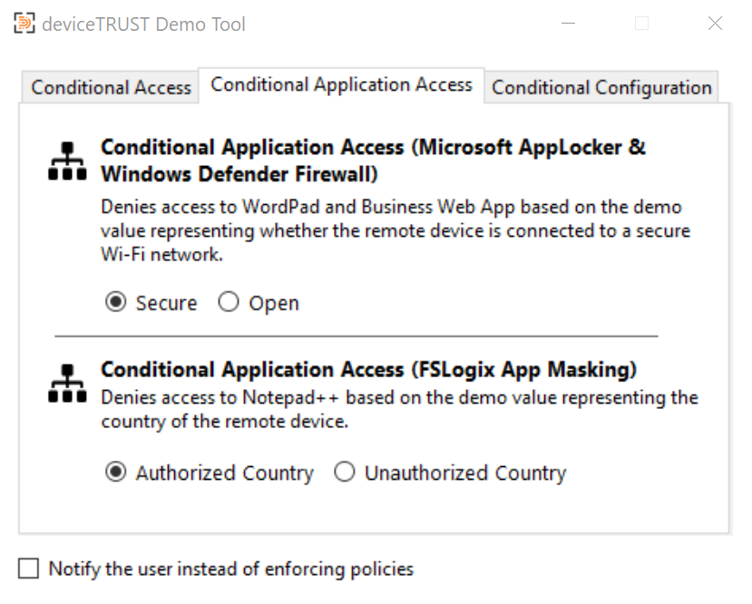

# deviceTRUST Demo-Box

We at deviceTRUST make our software, its understanding and presentation as simple and straight forward as possible. We understand the need of demos to be easy and clear. Aiming to offer you the possibility of presenting deviceTRUST and its functionalities in a most efficient and comprehensible way, we came up with the deviceTRUST Demo-Box and the deviceTRUST Demo-Tool.

The deviceTRUST Demo-Box is an automated process for converting an existing standalone Microsoft Server into a simple, fully functional deviceTRUST demo environment without the need to set up a full lab environment.

After running the setup script, just add your personal deviceTRUST license inside the deviceTRUST Console and you are ready to demonstrate deviceTRUST.

The deviceTRUST Demo-Box comes with our deviceTRUST Demo-Tool. The Demo-Tool is used to easily set different states of your endpoint during demonstrations. It is part of the deviceTRUST Demo-Box download.

## Before you start

Make sure to have a prepared VM as well as a client device ready to base the Demo-Box implementation on.

- Client Prerequisites: For now, the Demo-Box is only usable with a Windows based client. Our Demo-Tool can only be executed on Windows devices and is required for utilizing the Demo-Box.

- VM Prerequisites

  - Microsoft Server 2016, 2019 or 2022 

  - 2 vCPU, 2 GB RAM, 60 GB hard disk

  - All Updates applied (for security reasons - you know ;))
  
  - Workgroup member only - no domains
  
No additional requirements. The deviceTRUST Demo-Box process will implement all necessary changes and customizations
  
Please apply all personal changes (e.g., server name) after finishing the setup.

## Installation

There is a single PowerShell script to install the Demo-Box. Please execute the following command in an elevated PowerShell Session. You can obviously check the file's content before execution. Safety first! :)

```powershell
Invoke-Expression $((Invoke-WebRequest https://raw.githubusercontent.com/deviceTRUST/demo-box/main/dt-demo-box.ps1).content)
```

The script will install everything required for your Demo-Box implementation. You'll be asked to restart the machine once finished

## License

A valid license needs to be added to the configuration before you can start using the Demo-Box. Feel free to utilize your existing customer or NFR license. If you do not have a license available, [check out our community program](https://devicetrust.com/community) or [request an evaluation license](https://devicetrust.com/test-the-software) on our website.

| **Step** | **Screenshot** |
| -------- | -------------- |
|To add the license into the deviceTRUST policy open the deviceTRUST Console from the start menu.||
|Select "Open Local Policy"||
|Select the policy file (c:\ProgramData\deviceTRUST\Policy\dt-demo-box.dtpol)||
|Back in the Console, click the UNLICENSED link on the upper right corner.||
|Add your license key into the license box.||
|The Console will display a valid license now. Save the changed configuration.||

## Local device preparation

- Copy the folder deviceTRUST Demo-Box from the administrator’s desktop to the PC which will act as the remote device.

  -  The folder contains all the necessary resources to connect to the Demo-Box with the user “demo” via RDP.

  - The Subfolder “Demo Tool” contains the deviceTRUST Demo-Tool which needs to be started before connecting to the Demo-Box via RDP.

  - The Subfolder “Presentation” contains the deviceTRUST corporate slide deck in English and German language.

- Install the deviceTRUST Client Extension. You can either [download it from our website](https://devicetrust.com/download) or use Chocolatey (choco install dt-clientextension --y).
## Demo-Tool

In a lab as simple as the Demo-Box, you will want to demonstrate several use cases, while not making too much fuzz or being able to change parameters like your location. The deviceTRUST Demo-Tools allows you to simulate certain property changes with a simple click. It is designed to give insight into what can be achieved with deviceTRUST - in a very simple way.

Our Demo-Box is designed to work with the Demo-Tool. Please start the Demo-Tool before you connect to the Demo-Box via RDP. You'll otherwise end up with a bunch of Pop-Ups.

These Use Cases are integrated in the Demo-Tool

| **Use Case** | **Screenshot** |
| ------------ | -------------- |
| **Conditional Workspace Access:** Allows or disallows access to the user's session on the Demo-Box based on either the Security State or connected USB Sticks. | |
| **Conditional Application Access:** Closes example applications (Wordpad or Notepad++) inside the user's session based on the device's network connection or location. | |
| **Conditional Configuration:** Maps printers according to the user's location or controls the session's screensaver based on the device's configuration. | |

## Additional Use Cases

We have integrated a few real use cases into the Demo-Box as well. You can change the properties of your client device to trigger actions in the Demo-Box

- Security State: Turn of your local firewall or antivirus to change your device's security state. This will leave the user's session logged ("Conditional Workspace Access").

- Process Monitoring: Run "Zoom" or "Snipping Tool" on your device to lock the user's session on the Demo-Box ("Conditional Workspace Access").

## First Logon

You are now ready to log on your user. Please use only the standard RDP client to do so. Enjoy!

- Default credentials

  - user/dT$

  - admin/dT$

## Support / Contribution / Feedback

If you have  feedback or feel we’re missing some important details, please drop us an e-mail: demobox(at)devicetrust.com. Thank you for your support!
